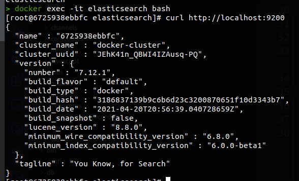

# README

My first project using Elasticsearch.
This project is based on the this tutorial: https://www.youtube.com/watch?v=ysccCsoap2o

Based on this, a summary of the configuration:

- add gem 'elasticsearch' and 'searchkick'
- add route 'search'
- add controller search
- add search field on the index page

- add searchkick on the Model - Post

- reindex the model:
  ```
    rails c
    Post.reindex
  ```

- for this moment, the search will be doing by Elasticsearch

- the format to deal with the render in the controller is using TURBO STREAM
  updating the div with id= post with the result of the search.

- For this project works, need the elasticsearch is running


There are some steps to do that with Docker:

  1. Download the image of elasticsearch:
  ```
    docker pull docker.elastic.co/elasticsearch/elasticsearch:7.12.1
  ```

  2. Start the image exposing the port
  ```
  docker run --name elasticsearch -d -p 9200:9200 -p 9300:9300 -e "discovery.type=single-node" docker.elastic.co/elasticsearch/elasticsearch:7.12.1
  ```

  3. Execute the bash inside of the container
  ```
  docker exec -it elasticsearch bash
  ```

  4. Inside the container test the route for elasticsearch
  ```
    curl http://localhost:9200
  ```

  you will see a answer like that:
  
